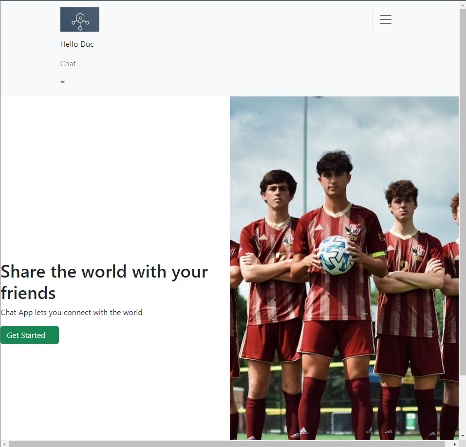
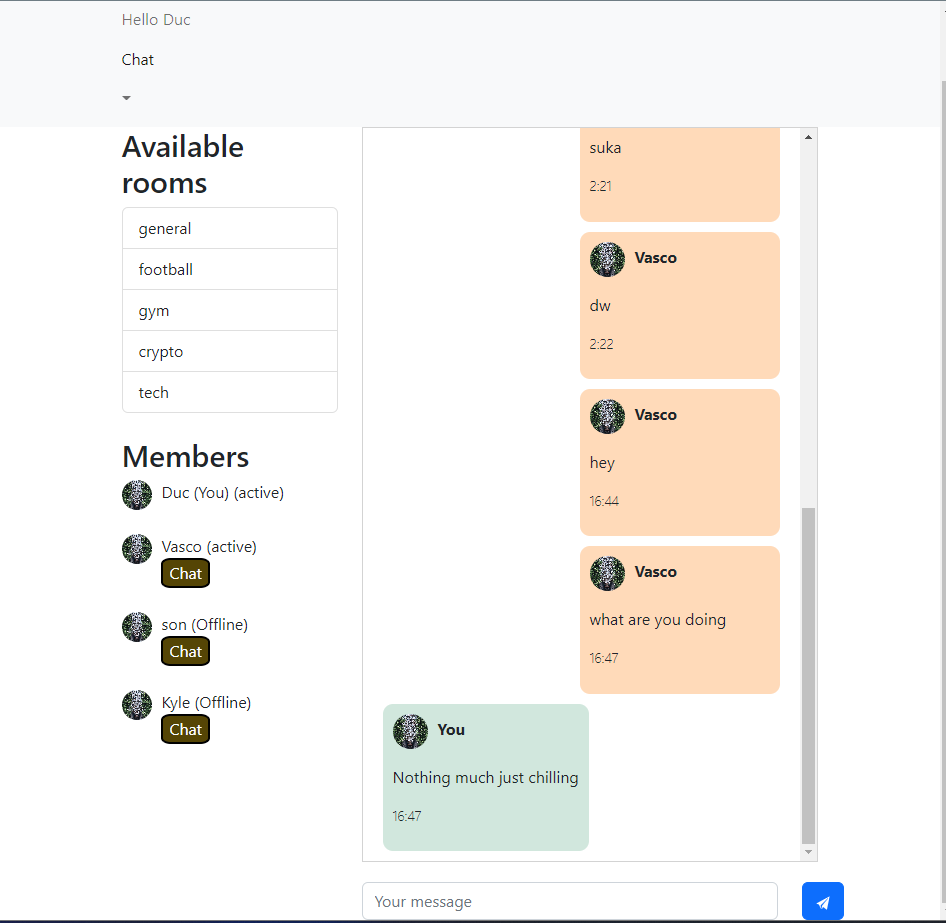

# HustleCord 

## A low-key simple chat app, inspired by Discord and hustle University 
* Tech stack: MERN (MongoDB, React , Node JS, Express) and Socket.io
* UI: Bootstrap

# Feature
* Users authentication and authorization
* Common chat rooms with different topics
* Private direct messages with another users 
* Active status

 

# Deploy:
* Backend: Heroku
* Frontend: Netlify
* Check out the new app [here](https://lustrous-cannoli-1419e7.netlify.app/) 

 
